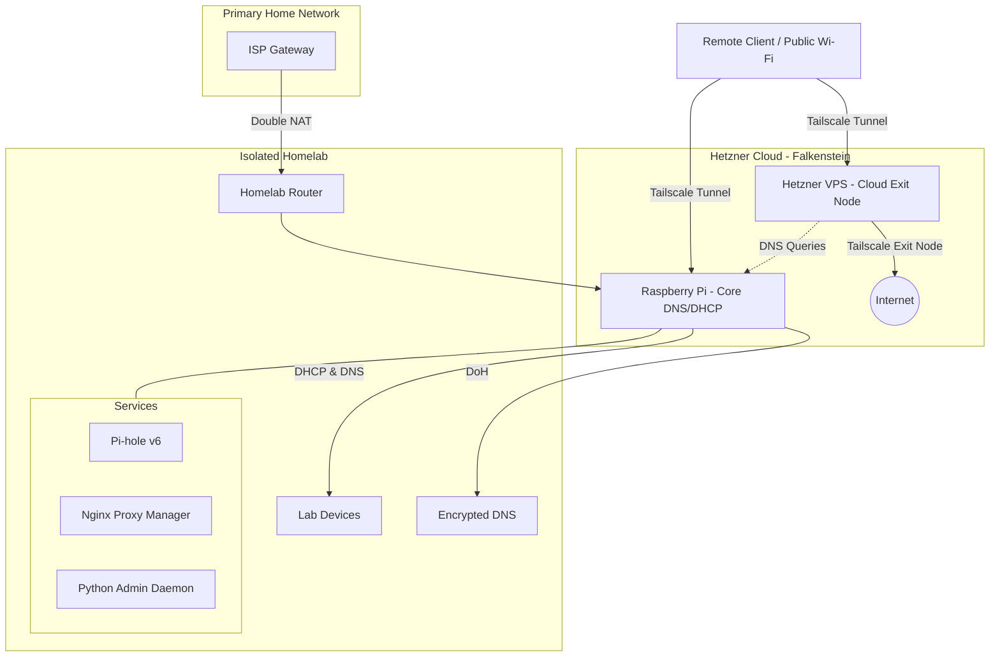
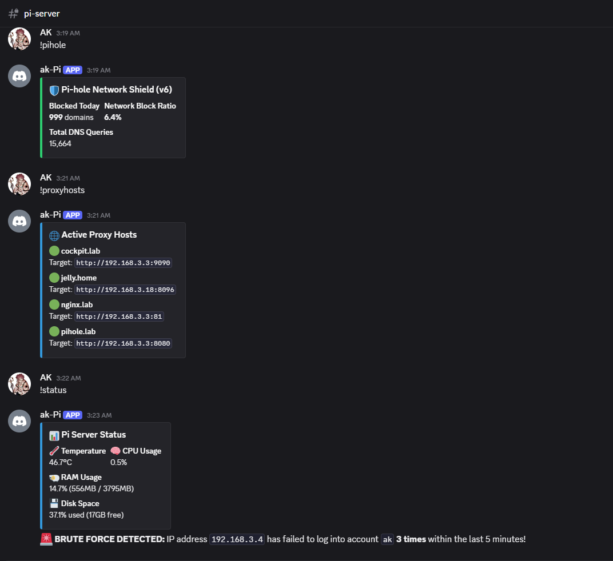

# Hybrid Cloud & Homelab Infrastructure

A production-style hybrid homelab that combines an isolated Raspberry Pi network with a Hetzner Cloud VPS using Tailscale. The environment is designed for secure remote administration, zero-trust networking, DNS-level privacy, containerized services, and Linux automation.

Rather than building a lab solely for experimentation, this infrastructure serves as my daily-driver environment, allowing me to apply cybersecurity and system administration concepts to real-world scenarios.

---

## Table of Contents

- [Features](#features)
- [Architecture](#architecture)
- [Infrastructure Components](#infrastructure-components)
- [Services & Automation](#services--automation)
- [Demo](#demo)
- [Technologies](#technologies)
- [Key Skills Demonstrated](#key-skills-demonstrated)
- [Lessons Learned & Challenges](#lessons-learned--challenges)
- [Future Work](#future-work)

---

## Features

- **Hybrid Architecture:** Seamless routing between cloud and on-premises infrastructure.
- **Network Segmentation:** Isolated homelab using Double NAT to protect the primary network.
- **Zero-Trust Access:** Authenticated remote administration overlay via Tailscale.
- **DNS-Level Security:** Network-wide ad blocking and telemetry filtering with Pi-hole.
- **Encrypted Resolution:** Upstream DNS-over-HTTPS (DoH) utilizing `dnscrypt-proxy`.
- **Internal Routing:** Local service hostname redirection managed via Nginx Proxy Manager.
- **Infrastructure Hardening:** Strict Access Control Lists (ACLs) using `ufw` and `systemd`.
- **Custom Automation:** Discord-based administration daemon for remote execution.
- **Active Defense:** Real-time threat monitoring and automated alerting.

---

## Architecture

### Design Goals

This infrastructure was designed around five core principles:

1. Keep the homelab strictly isolated from the primary household network.
2. Never expose management interfaces directly to the public Internet.
3. Secure remote administration through authenticated overlay networking.
4. Deploy applications securely using containers or managed systemd services.
5. Automate monitoring and administrative tasks wherever practical.

### Network Topology

---

## Infrastructure Components

### Network Segmentation

The homelab is intentionally placed behind a secondary router using **Double NAT**. This creates a hard security boundary between the experimental infrastructure and the primary household network, allowing services to be tested, broken, and deployed without exposing or impacting everyday devices.

VLANs would have been a cleaner way to segment the network, but the commercial-grade router used at home doesn't support VLAN tagging. Double NAT was the safest and most effective option available without replacing existing home networking hardware.

---

### Raspberry Pi Infrastructure

**Hardware:** Raspberry Pi 4 Model B (4 CPUs, 4 GB RAM)
**OS:** Raspberry Pi OS Lite

The Raspberry Pi acts as the backbone of the isolated subnet and provides core network services.

**Responsibilities:**
- DHCP server and local DNS resolver.
- Pi-hole DNS filtering and telemetry blocking.
- Global Tailnet DNS provider.
- Encrypted upstream DNS via systemd-socket activated `dnscrypt-proxy`.
- Cockpit for quick visual system health checks and package updates.

*Note: Because Pi-hole is configured as the primary DNS server for the Tailscale network, I retain network-wide DNS filtering and encrypted resolution whether I am connected from home, cellular, or public Wi-Fi.*

---

### Cloud Infrastructure

**Provider:** Hetzner Cloud (Falkenstein, Germany)
**Hardware:** 2 vCPU, 4 GB RAM, 40 GB SSD
**OS:** Ubuntu Server

The VPS serves as a secure cloud gateway and encrypted exit node.

**Responsibilities:**
- Tailscale Exit Node, routing outbound traffic through an authenticated tunnel so general internet access is masked behind the VPS's physical location rather than my home connection.
- Remote administration gateway.
- Cockpit for quick visual system health checks and package updates.

**Security Hardening:**
Since the VPS is the only host directly facing the public Internet, it's the only box in this setup protected with **UFW**, configured with a default-deny policy on incoming and routed traffic (outgoing allowed by default). Tailscale was installed and connected *before* applying that policy, since the initial setup was done over an SSH session on the public IP and applying deny-first would have locked me out. Tailnet traffic — including SSH and the Cockpit dashboard on port 9090 — still reaches the box under this default-deny policy without any explicit allow rule; see [Lessons Learned](#lessons-learned--challenges) for why. Hetzner's browser-based console is kept as a fallback recovery path in case a firewall misconfiguration ever locks out both access routes.

---

## Services & Automation

To keep the host operating systems clean and maintainable, services are strictly deployed using Docker containers or managed Linux system daemons.

### Docker Services

Current containerized services include:
- **Pi-hole** (DNS Sinkhole)
- **Nginx Proxy Manager** (Reverse Proxy)
- **Oracle Sniper** (OCI Cloud Provisioning Automation) — a script that continuously polls the Oracle Cloud API for available capacity on their free-tier Ampere instance (2 OCPUs / 12 GB RAM, up to 200 GB storage). Free-tier ARM capacity is notoriously scarce, so the script automatically attempts instance creation whenever a slot opens up, and sends a Discord heartbeat message every 40 attempts to confirm it's still running and show progress. It's been running for about two months without a successful allocation yet, but it costs nothing to leave running in the background. *As with the Discord admin bot, AI assisted with generating portions of the script; the logic, deployment, and integration were directed and verified by me.*

---

### Discord Administration Bot

To streamline infrastructure management, I developed a custom Python-based administration daemon that allows me to securely monitor and manage the homelab directly through Discord.

*While AI assisted with generating portions of the boilerplate code, the infrastructure design, deployment architecture, hardening, authentication model, and system integration were entirely engineered by me. The focus of this project was applying software securely within a production-like environment.*

**Deployment & Security:**
The bot is deployed as a hardened `systemd` service utilizing:
- Automatic restarts on failure for high availability.
- Environment-variable injection for API secrets.
- Command execution restricted explicitly to my Discord User ID.

**Capabilities:**

1. **Threat Monitoring**
   - Tails `journalctl` in real-time using Python `asyncio`.
   - Detects successful SSH logins.
   - Alerts on brute-force attempts (flagging 3+ failed logins from a single IP within five minutes).
2. **Resource Monitoring**
   - Continuously monitors CPU utilization, memory usage, and hardware thermals.
   - Automatically pushes alerts to Discord when safe thresholds are exceeded.
3. **Infrastructure Management**
   - Allows remote restarting of Docker containers and host reboots.
   - Broadcasts Wake-on-LAN (WoL) magic packets to wake physical machines.
4. **API Integrations**
   - Hooks into the Pi-hole v6 and Nginx Proxy Manager APIs.
   - Retrieves live DNS statistics, ad-blocking metrics, and live routing targets on demand.

---

## Demo

---

## Technologies

| Category | Technologies |
|-----------|--------------|
| **Operating Systems** | Raspberry Pi OS Lite, Ubuntu Server |
| **Networking** | Tailscale, Pi-hole, dnscrypt-proxy |
| **Containers** | Docker, Nginx Proxy Manager |
| **Administration** | systemd, Cockpit, UFW |
| **Programming** | Python, Bash |
| **APIs** | Pi-hole API, Nginx Proxy Manager API, Oracle Cloud API |

---

## Key Skills Demonstrated

- Linux System Administration
- Network Segmentation & Subnetting
- Zero-Trust Networking Principles
- Cloud Infrastructure Management
- Docker Deployment & Orchestration
- DNS Infrastructure Security
- Infrastructure Hardening & Firewalls
- Python Automation & API Integration
- Real-Time Service Monitoring
- Security Engineering & Access Control

---

## Lessons Learned & Challenges

**DNS wouldn't work without DHCP:** My router doesn't allow assigning a custom DNS server to DHCP clients directly, so simply pointing devices at the Pi as a DNS server wasn't possible at the network level. The fix was making the Raspberry Pi handle both DHCP and DNS — every device on the lab network gets its IP lease *and* its DNS server assigned by Pi-hole, guaranteeing all traffic goes through the filter.

**Docker networking with Pi-hole:** Getting Pi-hole's container networking to play nicely alongside other Docker services (particularly around port 53 and host networking) was confusing at first. It took some trial and error to land on a stable configuration, but it's been reliable since.

**UFW and Tailscale don't interact the way you'd expect:** I assumed I'd need an explicit UFW allow rule for the `tailscale0` interface, but tailnet traffic — SSH, and later the Cockpit dashboard on port 9090 — reached the VPS without one, even under a default-deny policy. Tailscale runs in netfilter mode `on` by default, inserting its own high-priority rules that accept traffic on its interface ahead of UFW. Worth verifying with `ufw status verbose` rather than assuming `deny` covers every path in.

---

## Future Work

- Repurposing an old laptop into a dedicated media server for movies and TV shows.
- Evaluating a unified dashboard platform to manage multiple servers and services from a single pane of glass.
- Expanding automation across the lab — reducing manual intervention for deployments, monitoring, and maintenance tasks.
